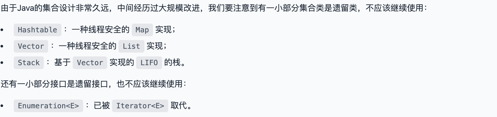

# 集合
Collection
 - List：一种有序列表的集合，例如，按索引排列的Student的List；
 - Set：一种保证没有重复元素的集合，例如，所有无重复名称的Student的Set；
 - Map：一种通过键值（key-value）查找的映射表集合，例如，根据Student的name查找对应Student的Map

集合设计特点
 - 实现了接口跟接口类的分离
 - 支持泛型

Java访问集合总是通过统一的方式——迭代器（Iterator）来实现，它最明显的好处在于无需知道集合内部元素是按什么方式存储的。

# List的学习

List 是一种最基础集合，它是一种有序列表
- List的行为和数组几乎完全相同
- 实际应用中，需要增删元素的有序列表，我们使用 **最多的是ArrayList**

## ArrayList
主要是几个方法
- 在末尾添加一个元素：boolean add(E e)
- 在指定索引添加一个元素：boolean add(int index, E e)
- 删除指定索引的元素：E remove(int index)
- 删除某个元素：boolean remove(Object e)
- 获取指定索引的元素：E get(int index)
- 获取链表大小（包含元素的个数）：int size()

## 比较一下ArrayList和LinkedList：

|            | ArrayList | LinkedList |
|------------|-----------|------------|
| 获取指定元素     | 速度很快      | 需要从头开始查找元素 |
| 添加元素到末尾    | 	速度很快	    | 速度很快       |
| 在指定位置添加/删除 | 	需要移动元素	  | 不需要移动元素    |
| 内存占用	      | 少	        | 较大         |

通常情况下，我们总是优先使用ArrayList。

