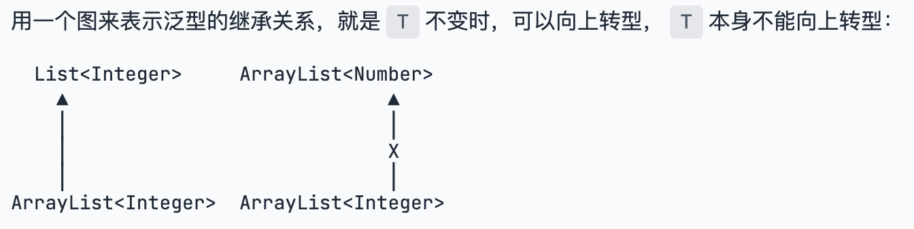

# 什么是泛型
实现了编写一次，万能匹配，又通过编译器保证了类型安全：这就是泛型。
```java
ArrayList<String> strList = new ArrayList<String>();
```
## 向上转型
ArrayList<Integer>和ArrayList<Number>两者完全没有继承关系。


# 使用泛型

## 泛型接口

```text
小结
使用泛型时，把泛型参数<T>替换为需要的class类型，例如：ArrayList<String>，ArrayList<Number>等；

可以省略编译器能自动推断出的类型，例如：List<String> list = new ArrayList<>();；

不指定泛型参数类型时，编译器会给出警告，且只能将<T>视为Object类型；

可以在接口中定义泛型类型，实现此接口的类必须实现正确的泛型类型。
```

## 编写泛型

### 小结
编写泛型时，需要定义泛型类型<T>；
静态方法不能引用泛型类型<T>，必须定义其他类型（例如<K>）来实现静态泛型方法；
泛型可以同时定义多种类型，例如Map<K, V>。

# 擦拭法
Java的泛型是采用擦拭法实现的；

擦拭法决定了泛型<T>：

- 不能是基本类型，例如：int；
- 不能获取带泛型类型的Class，例如：Pair<String>.class；
- 不能判断带泛型类型的类型，例如：x instanceof Pair<String>；
- 不能实例化T类型，例如：new T()。
- 泛型方法要防止重复定义方法，例如：public boolean equals(T obj)；
- 子类可以获取父类的泛型类型<T>。